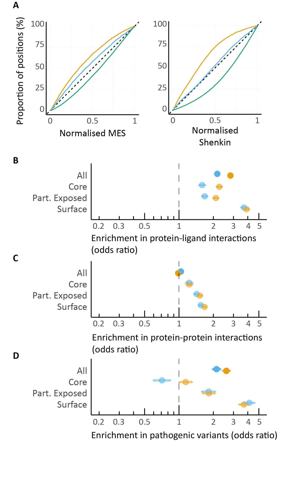
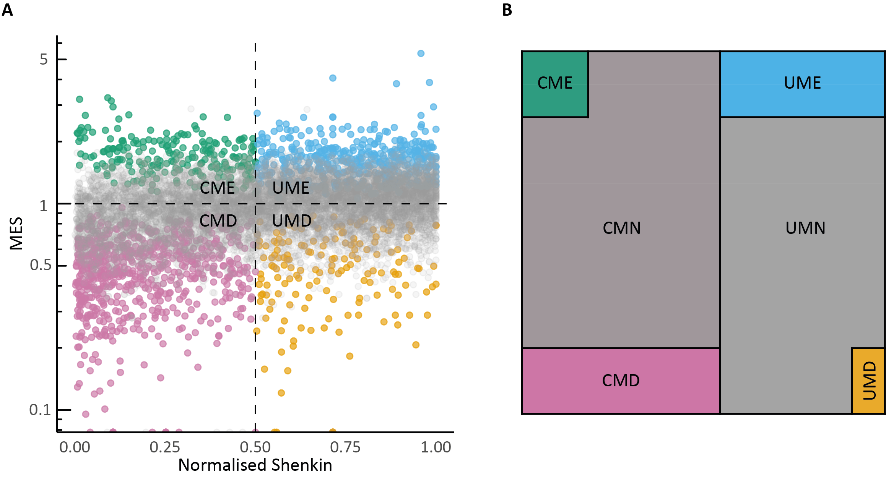
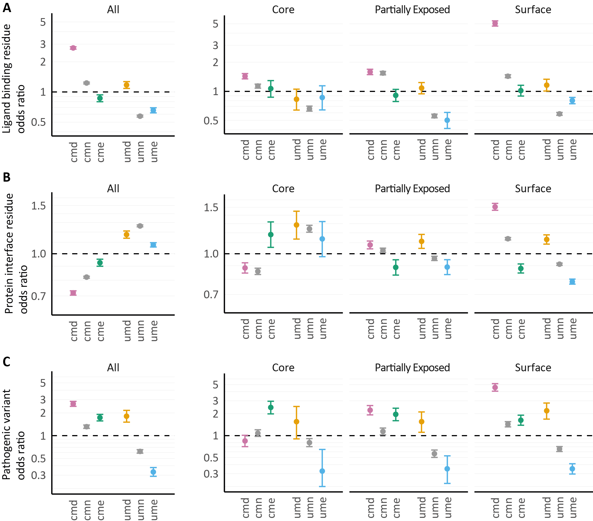

# A unified approach to evolutionary conservation and population constraint in proteins
Repository containing notebooks to compute statistics in the paper "A unified approach to evolutionary conservation and population constraint in proteins".

This repository and its contents were created by Stuart A. MacGowan (@stuartmac) at the University of Dundee and is provided under the MIT license. See [LICENSE](LICENSE) for details.

## Dataset
The analysis is based on aggregated statistics we computed from data accessed from the following databases:
- [Pfam-A](https://pfam.xfam.org/) database of protein families (version 31.0)
- [gnomAD](https://gnomad.broadinstitute.org/) database of human genetic variation (version 2.1.1).
- [ClinVar](https://www.ncbi.nlm.nih.gov/clinvar/) database of human genetic variants and their clinical significance.
- [PDBe](https://www.ebi.ac.uk/pdbe/) database of protein structures.

These were processed into a single dataset of aggregated statistics for each Pfam domain, which is provided in `data/pfam-gnomAD-clinvar-pdb-colstats_c7c3e19.csv.gz`.

## Manuscript figures

The figures in the manuscript are generated by the notebooks in the figure folders under [manuscript-figures](manuscript-figures/).

The figures are shown below with links to the notebooks for each panel.

### Figure 1

**Figure 1:** Population diversity in Pfam domains is often positively correlated with evolutionary diversity.

- **A.** An excerpt of the Phospholipase A2 1 domain (PF00068) highlighting sites with missense variants from gnomAD (red). The histogram shows the number of missense variants at each position across all 10 human sequences in the Pfam domain.
- **B.** Frequency distribution of gnomAD missense variants across all amino acid residues in Pfam domains ([link to notebook](manuscript-figures/fig1/Fig1B_pfam-residue-missense-hist.md)).
- **C.** Frequency distributions of gnomAD missense variants over alignment columns of Pfam domains containing 1, 5, or 9 (left to right) human sequences ([link to notebook](manuscript-figures/fig1/Figs1C-D_variant-totals-in-MSA-columns.md)).
- **D.** The total number of gnomAD missense (left) or synonymous (right) variants vs. the Shenkin diversity at each position across SH2 domains (PF00017) and linear regressions (left panel: m = 0.23, c = 22; right panel: m = 0.00, c = 20) ([link to notebook](manuscript-figures/fig1/Figs1C-D_variant-totals-in-MSA-columns.md)).
- **E.** The distribution of regression coefficients for gnomAD missense (upper panel) or synonymous (lower panel) variant totals against Shenkin divergence across 5,975 Pfam domains. Regression coefficients with p < 0.05 are colored blue.
- **F.** Inter-domain interactions of the SH2 domain in inactivated Proto-oncogene tyrosine-protein kinase Src (SRC; PDB ID: 2src60). The surface is colored according to the Missense Enrichment Score (MES; red to yellow) calculated from the SH2 Pfam domain (PF00017).

### Figure 2

**Figure 2.** The structural and functional properties of missense depleted positions compared to evolutionarily conserved positions.

- A. Cumulative distributions of the normalised missense enrichment score (MES; left) or normalised Shenkin (right) for positions where the consensus relative solvent accessibility class is core (orange), partially exposed (blue) or surface (green) ([link to notebook](manuscript-figures/fig2/Fig2A_RSA-Class-Distribution.md)).
- B-D. Odds ratios (95% CI) measuring the enrichment of protein-ligand interactions (B), protein-protein interactions (C) and pathogenic variants (D) within conserved (orange) or missense depleted columns (blue) and stratified by solvent exposure class.

### Figure 3

**Figure 3.**

- **A.** The conservation plane: classifying residues in Pfam domains with evolutionary conservation and population constraint. Each point represents a position in a Pfam domain. The x-coordinate is the normalised Shenkin entropy, which indicates the residue diversity across all sequences at that site. The y-coordinate is the missense enrichment score odds ratio (MES), which quantifies the total variability amongst the human paralogs at the site in the gnomAD cohorts. The plane is divided into quadrants which categorise each position with respect to evolutionary conservation and population constraint. The quadrants are labelled conserved and missense depleted (CMD), conserved and missense enriched (CME), unconserved and missense enriched (UME) and unconserved and missense depleted (UMD). Colour indicates positions that are significantly missense depleted (pink = CMD, orange = UMD), or missense enriched at p < 0.1 (green = CME, blue = UME). The two missense neutral categories (CMN and UMN) are represented by the points coloured grey. Half-circular points on the x-axis have MES = 0 (i.e., there are no missense variants at this site). The plot represents a random sample comprising 10,000 sites from 282 Pfam domains ([link to notebook](manuscript-figures/fig3/Fig3A_Conservation-Plane.md)).
- **B.** Area plot depicting the proportion of residues within the different conservation plane categories.
### Figure 4

**Figure 4.** The enrichment of interactions and clinical variants in different regions of the conservation plane and different solvent accessibilities.
- **A.** Odds ratios of the enrichment of protein-ligand interacting residues from BioLiP66 within sites in different conservation plane categories ignoring accessibility (left, headed “All”) or restricted to a single accessibility class (“Core”, “Partially Exposed” or “Surface”). The points are arranged to emphasise the functional stratification of conserved (first three points) and unconserved positions (second group of three points) by missense depletion, missense neutrality and missense enrichment. Error bars indicate 95 % CI. Odds ratios of the enrichment of protein-ligand interacting residues within sites of different categories calculated independently for each RSA burial class ([link to notebook](manuscript-figures/fig4/Fig4A_BioLiP-XClass-Enrichments.md)).
- **B.** PPI site enrichments calculated ignoring RSA burial class. PPI site enrichment calculated independently for each RSA burial class ([link to notebook](manuscript-figures/fig4/Fig4B_PPI-XClass-Enrichments.md)).
- **C.** ClinVar Pathogenic site enrichments relative to the gnomAD missense background calculated ignoring RSA burial class. ClinVar Pathogenic site enrichment relative to the gnomAD missense background calculated independently for each RSA burial ([link to notebook](manuscript-figures/fig4/Fig4C_ClinVar-XClass-Enrichments.md)).