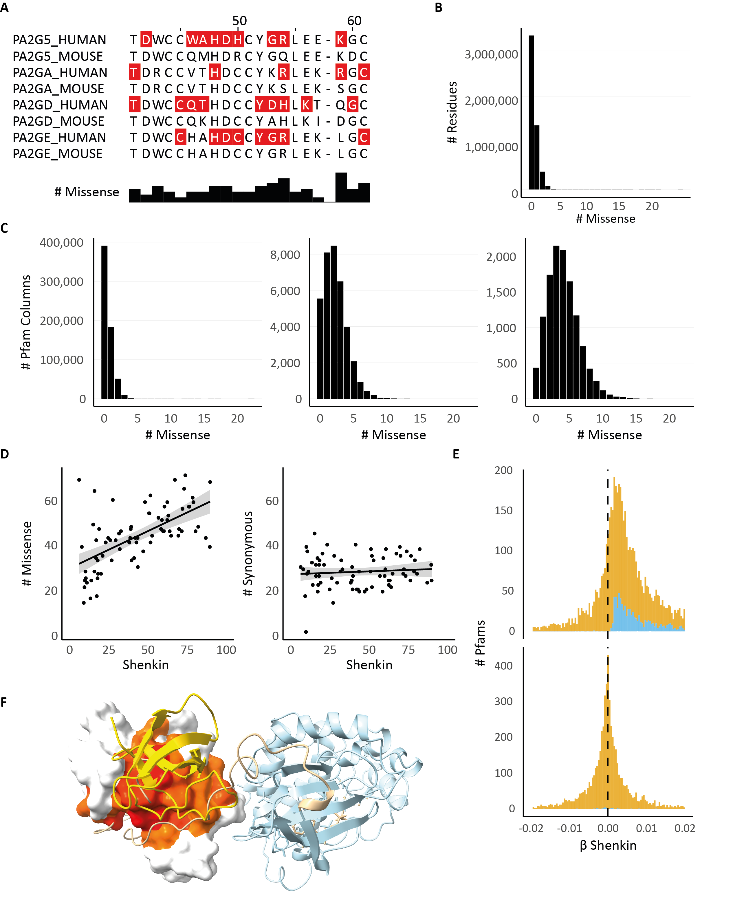

# A unified approach to evolutionary conservation and population constraint in proteins
Repository containing notebooks to compute statistics in the paper "A unified approach to evolutionary conservation and population constraint in proteins".

This repository and its contents were created by Stuart A. MacGowan (@stuartmac) at the University of Dundee and is provided under the MIT license. See [LICENSE](LICENSE) for details.

## Dataset
The analysis is based on aggregated statistics we computed from data accessed from the following databases:
- [Pfam-A](https://pfam.xfam.org/) database of protein families (version 31.0)
- [gnomAD](https://gnomad.broadinstitute.org/) database of human genetic variation (version 2.1.1).
- [ClinVar](https://www.ncbi.nlm.nih.gov/clinvar/) database of human genetic variants and their clinical significance.
- [PDBe](https://www.ebi.ac.uk/pdbe/) database of protein structures.

These were processed into a single dataset of aggregated statistics for each Pfam domain, which is provided in `data/pfam-gnomAD-clinvar-pdb-colstats_c7c3e19.csv.gz`.

## Manuscript figures

The figures in the manuscript are generated by the notebooks in the figure folders under [manuscript-figures](manuscript-figures/).

The figures are shown below with links to the notebooks for each panel.

**Figure 1:** Population diversity in Pfam domains is often positively correlated with evolutionary diversity.

- **A.** An excerpt of the Phospholipase A2 1 domain (PF00068) highlighting sites with missense variants from gnomAD (red). The histogram shows the number of missense variants at each position across all 10 human sequences in the Pfam domain.
- **B.** Frequency distribution of gnomAD missense variants across all amino acid residues in Pfam domains ([link to notebook](manuscript-figures/fig1/Fig1B_pfam-residue-missense-hist.md)).
- **C.** Frequency distributions of gnomAD missense variants over alignment columns of Pfam domains containing 1, 5, or 9 (left to right) human sequences ([link to notebook](manuscript-figures/fig1/Figs1C-D_variant-totals-in-MSA-columns.md)).
- **D.** The total number of gnomAD missense (left) or synonymous (right) variants vs. the Shenkin diversity at each position across SH2 domains (PF00017) and linear regressions (left panel: m = 0.23, c = 22; right panel: m = 0.00, c = 20) ([link to notebook](manuscript-figures/fig1/Figs1C-D_variant-totals-in-MSA-columns.md)).
- **E.** The distribution of regression coefficients for gnomAD missense (upper panel) or synonymous (lower panel) variant totals against Shenkin divergence across 5,975 Pfam domains. Regression coefficients with p < 0.05 are colored blue.
- **F.** Inter-domain interactions of the SH2 domain in inactivated Proto-oncogene tyrosine-protein kinase Src (SRC; PDB ID: 2src60). The surface is colored according to the Missense Enrichment Score (MES; red to yellow) calculated from the SH2 Pfam domain (PF00017).
