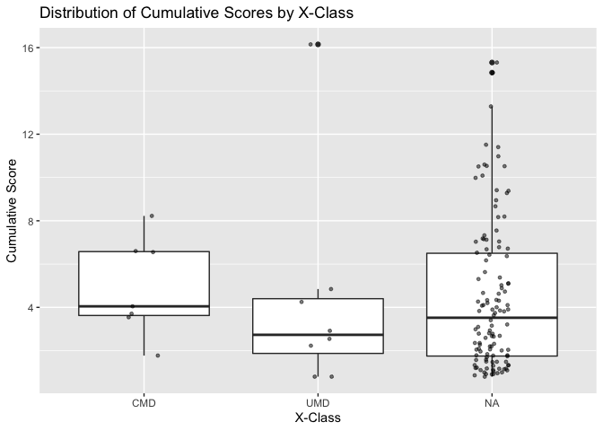

Evaluation of EVcouplings data for NR-LBD of STF-1
================

``` r
# Load required libraries
library(ggplot2)
library(readr)
library(dplyr)
```

    ## 
    ## Attaching package: 'dplyr'

    ## The following objects are masked from 'package:stats':
    ## 
    ##     filter, lag

    ## The following objects are masked from 'package:base':
    ## 
    ##     intersect, setdiff, setequal, union

``` r
library(tidyverse)
```

    ## ── Attaching packages
    ## ───────────────────────────────────────
    ## tidyverse 1.3.2 ──

    ## ✔ tibble  3.1.8     ✔ stringr 1.4.1
    ## ✔ tidyr   1.2.0     ✔ forcats 0.5.2
    ## ✔ purrr   0.3.4     
    ## ── Conflicts ────────────────────────────────────────── tidyverse_conflicts() ──
    ## ✖ dplyr::filter() masks stats::filter()
    ## ✖ dplyr::lag()    masks stats::lag()

``` r
# Read the data from CSV file
evcouplings_data <- read_csv("data/evcouplings_data.csv")
```

    ## New names:
    ## Rows: 133 Columns: 9
    ## ── Column specification
    ## ──────────────────────────────────────────────────────── Delimiter: "," chr
    ## (3): segment_i, A_i, X_class dbl (4): i, pair_count, cumulative_score,
    ## conservation lgl (2): ...8, UMDs not coupled: Q352, A433
    ## ℹ Use `spec()` to retrieve the full column specification for this data. ℹ
    ## Specify the column types or set `show_col_types = FALSE` to quiet this message.
    ## • `` -> `...8`

``` r
# Assign a new category "Other" to the rows with missing X-class values
evcouplings_data <- evcouplings_data %>%
  mutate(X_class = ifelse(is.na(X_class), "Other", X_class))

# Reorder the levels of the factor X_class
evcouplings_data$X_class <- factor(evcouplings_data$X_class, levels = c("CMD", "UMD", "Missing"))

# Plot the distribution of cumulative scores for different X-classes with data points overlaid
ggplot(evcouplings_data, aes(x = X_class, y = cumulative_score)) +
  geom_boxplot() +
  geom_jitter(width = 0.1, alpha = 0.5, size = 1) +
  labs(title = "Distribution of Cumulative Scores by X-Class",
       x = "X-Class",
       y = "Cumulative Score")
```

<!-- -->

``` r
# Perform Kruskal-Wallis test to compare distributions
kruskal_result <- kruskal.test(cumulative_score ~ X_class, data = evcouplings_data)
print(kruskal_result)
```

    ## 
    ##  Kruskal-Wallis rank sum test
    ## 
    ## data:  cumulative_score by X_class
    ## Kruskal-Wallis chi-squared = 1.3417, df = 1, p-value = 0.2467
