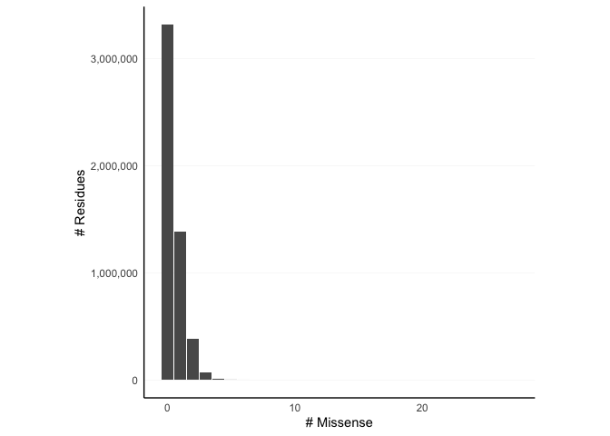

Figure 1B: Frequency distribution of missense variants at Pfam residues
================

This notebook creates a plot from pre-computed missense variant
frequencies over residues in the Pfam-gnomAD dataset.

``` r
suppressPackageStartupMessages(library(dplyr))
library(ggplot2)
library(readr)


# Load pre-computed frequencies
pfam_res_mis_freqs <-
  read_csv(
    "data/pfam-residue-missense-counts-summary.csv",
    col_types = cols(missense_variants = col_double(),
                     freq = col_double())
  )
pfam_res_mis_freqs
```

    ## # A tibble: 24 × 2
    ##    missense_variants    freq
    ##                <dbl>   <dbl>
    ##  1                 0 3315914
    ##  2                 1 1381407
    ##  3                 2  384094
    ##  4                 3   70803
    ##  5                 4    9259
    ##  6                 5     923
    ##  7                 6     115
    ##  8                 7      42
    ##  9                 8      34
    ## 10                 9      24
    ## # … with 14 more rows

``` r
# Plot the histogram
(
  pfam_res_mis_freqs
  |> ggplot()
  + aes(x = missense_variants, y = freq)
  + geom_bar(stat = 'identity')
  
  # Annotations
  + xlab('# Missense')
  + ylab('# Residues')
  + scale_y_continuous(labels = scales::comma)
  
  # Theme
  + theme_minimal()
  + theme(aspect.ratio = 1)
  + theme(
    axis.line = element_line(color = 'black'),
    panel.grid.minor = element_blank(),
    panel.grid.major = element_line(size = 0.1),
    panel.grid.major.x = element_blank(),
  )
)
```

<!-- -->

``` r
ggsave('plot1b.svg')
```

    ## Saving 7 x 5 in image
